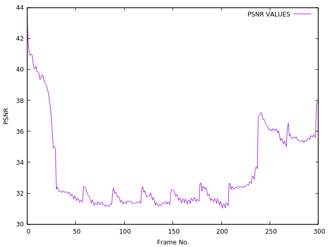

###### :rocket: my first networking project :rocket:
## Throughput, Delay, and PSNR Calculation
### Throughput, Delay, and PSNR were calculated using NS-2 Simulator, Awk Script, and EvalVid Framework.

*  Technologies: C, Awk
*  Tools and OS: NS-2, EvalVid, Geany, Ubuntu
*  Platform: Command-line
*  Lines of Code: 49
*  Duration: 1 Week (NOV 2016)

### PSNR of Frames

